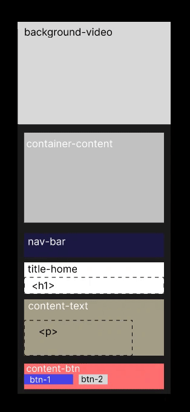
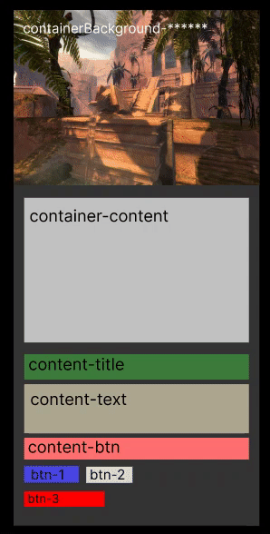

<h1>Site Dragons Of Draezor</h1>

<div align="center">
  
</div>

   Projeto de desenvolvimeto de um site para divulgação da guilda **Dragons Of Draezor** do jogo online ***Guild Wars 2*** promovido pela empresa ***ArenaNet***.
  O site se trata de uma landing page que tem o objetivo de divulgar a guilda, caso o usuário se interesse o mesmo é encaminhado ao Discord da guilda onde estão concentradas todas as informações. Além disso, há também links que encaminham o usuário para o youtube e instagram da guilda.
<br><br>
Para conferir o site <a href="https://hondacoding.github.io/Site-DragonsOfDraezor/">clique aqui!</a>
<br>

## 🤯 Principais preocupações durante o desenvolvimento:
- **Estrutura do site**: estruturar o site de forma a eliminar redundâncias, utilizando variáveis e classes para reduzir a quantidade de código.
- **Organização do CSS**: organizar o css de forma lógica, simples e de fácil entendimento e manutenção.
- **UX/UI** : levou-se em conta o design com cores chamativas, fontes coniventes, fácil navegação e informações curtas e diretas de forma que instigue o usuário a *saber mais*.
- **Fundamentos da Programação Web**: desenvolvido sem o uso de bibliotecas/frameworks que otimizam o design, o objetivo foi de consolidar conceitos básicos de html, css, javascript e flexbox.
- **Responsividade**: tornar o site acessível para mobile, de forma que a navegação e leitura fique adequada.
<br>

## 🧱 Estrutura de construção do site:
A estrutura do site foi pensada de forma a possuir **'2 Containers principais'** de classes que seriam reutizadas ao longo do site com o objetivo de reduzir repetição de código. Estes **'2 Containers principais'** podem ser entendidos como uma espécie de *Conjunto de Classes*, e foram divididos em:
- **1º Container principal**: relacionado a seção que possui vídeo como fundo, ou seja, a primeira seção, quando o site é aberto;
- **2º Container principal**: relacionado as demais seções da página como por exemplo, **Quem é a DD**, **World VS World**, **Junte-se a nós** e **STAFF**.


> [!NOTE]
> O **1º Container principal** será utilizado somente uma vez, pois só existe uma seção com *vídeo de fundo* e *barra de navegação*. Dessa maneira, as demais seções, excluíndo o **footer** (rodapé), utlizarão o conjunto de classes do **2º Container principal**. A organização/hierarquia entre cada elemento nestes **'2 Containers principais'** pode ser observada no gif abaixo:
<br>

<div>
  
    
</div>
<br>

Podemos ver como a classe **"container-content"** é responsável por afastar todos os elementos das bordas do site (através do padding), e portanto, todas as seções que utilzarem esta classe terão seus elementos afastados da borda, seguindo um padrão e não sendo necessário declarar o mesmo padding toda vez para cada tag, basta atribuir essa classe à tag, como podemos observar na estrutura do código abaixo:

```css
<div id="quemsomos" class="containerBackground-sobrenos container">
        <div class="container-content">
            <div class="content-title">
                <h1 class="format-title"></h1>
            </div>
            <div class="content-text">
                <p class="format-text"></p>
            </div>
            <div class="content-btn">
                <button class="btn-3 format-btn open-modal-btn"></button>
            </div>
        </div>
</div>
```

>[!IMPORTANT]
> Todas as **div** que se tratam de **content-title** ou **content-text** utilizam width de 100% pensando em um melhor manejo na hora de aplicar a responsividade. Dessa forma, a estilização quanto a posição do texto, tamanho e cor ficam por responsabilidade das classes **.format-** ("format-title", "format-text", etc). 
<br>

## 📑 Organização do CSS:
O CSS foi dividido em categorias da seguinte maneira:
- Reset de margin,padding e border do elemento pai principal **BODY** e o  upload de fontes de texto;
- **VARIÁVEIS DE COR:** variáveis de cores de forma a padronizar as cores utilizadas nos textos, titulos e botões;
- **FLEX:** diz respeito ao display flex-box, de forma que não seja preciso declarar "display: flex" e as demais funcionalidades do flex em todo elementos, basta usar estas classes;
- **FORMATAÇÔES DE TEXTO:** são classes que tem o objetivo de formatar os textos e títulos, quanto a cor, tamanho e posição;
- **CONTAINER BACKGROUNDS:** responsáveis por determinar a imagem de fundo da seção, além de tamanho (heigh) e outras caracteristicas quanto ao background;
- **CONTENT:** como o nome ja diz, tem o objetivo de posicionar os conteúdos que estarão na seção (titulo, texto e botoes) , neste caso será basicamente o padding em relação aos outros elementos;
- **NAV-BAR:** todas as características do <nav> se encontram aqui, como cor, tamanho e todos os elementos que estão dentro da barra de navegação superior;
- **BOTOES:** configura as características dos botoes, como tamanho e cor;
- **FOOTER:** responsável por determinar o tamanho das partes upper/lower do footer, lower é responsável por fazer a linha horizontal que divide as  duas partes;
- **BACK TO TOP:** botão que se encontra no canto direito inferior do site a medida que o mesmo é rolado para baixo;
- **MODAL:** diz respeito ao modal que se abre quando clicado no botão "Conheça a nossa trajetória completa" e "Trajetória da DD", configurações de posição, cor e tudo relacionado ao modal;
- **MEDIA QUERIES:** relacionado a responsividade.

>[!TIP]
> *As categorias são dividas por comentarios utilizando* "==============================================" 
<br>

## 💻 Tecnologias utilizadas no desenvolvimento:
- 
- 
- 
- 


