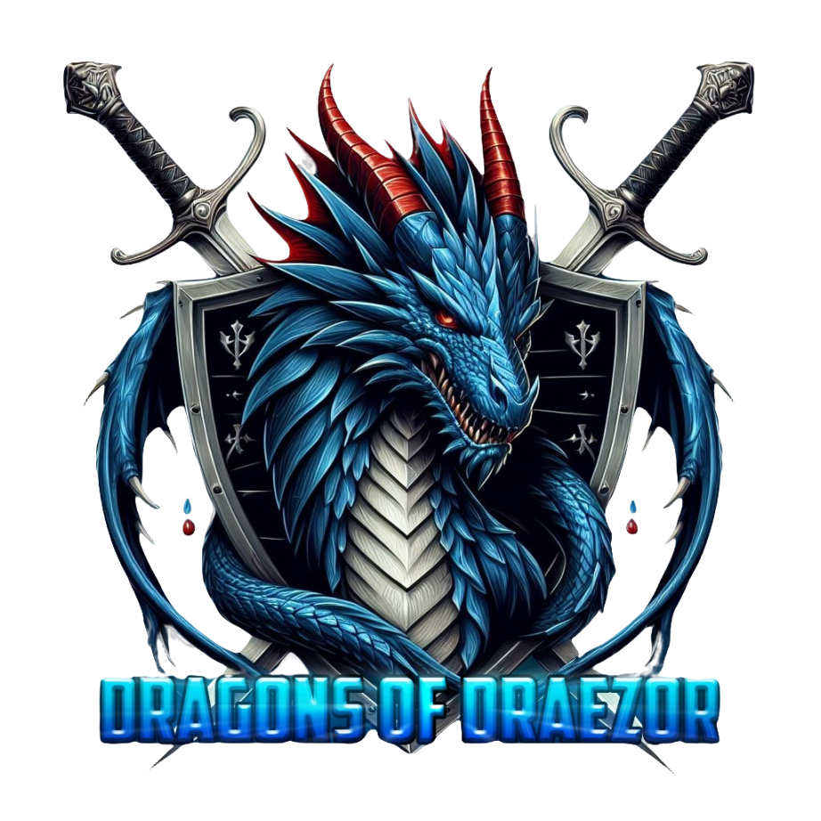

<h1>Site Dragons Of Draezor</h1>

  

   Projeto de desenvolvimeto de um site para divulgação da guilda **Dragons Of Draezor** do jogo online ***Guild Wars 2*** promovido pela empresa ***ArenaNet***.
  O site se trata de uma landing page que tem o objetivo de apenas divulgar a guilda, caso o usuário se interesse, o mesmo é encaminhado ao Discord da guilda onde estão concentradas todas as informações. Além disso, há também links que encaminham o usuário para o youtube e instagram da guilda.
  
Para conferir o site <a href="https://hondacoding.github.io/Site-DragonsOfDraezor/">clique aqui!</a>
 
## Principais preocupações durante o desenvolvimento:
- **UX/UI** : a experiência do usário, levando em conta o design, cores chamativas, fácil navegação, informações curtas e diretas de forma que instigue o usuário a *saber mais*.
- **Básico da Programação Web**: o código foi desenvolvido de forma tradicional e sem bibliotecas/frameworks que otimizam o design, com o objetivo de consolidar conceitos básicos de css e html.

##  Tecnologias utilizadas no desenvolvimento:
- 
- 
- 

